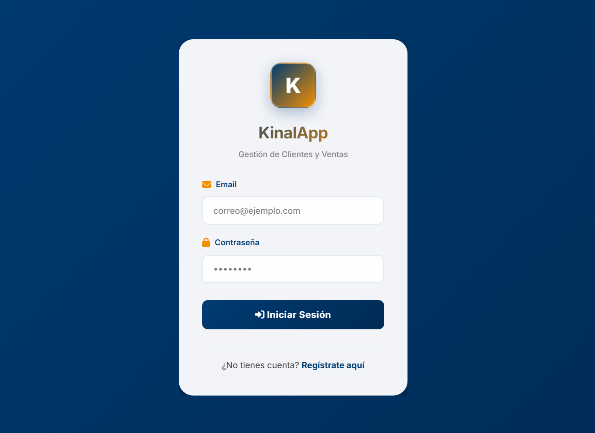
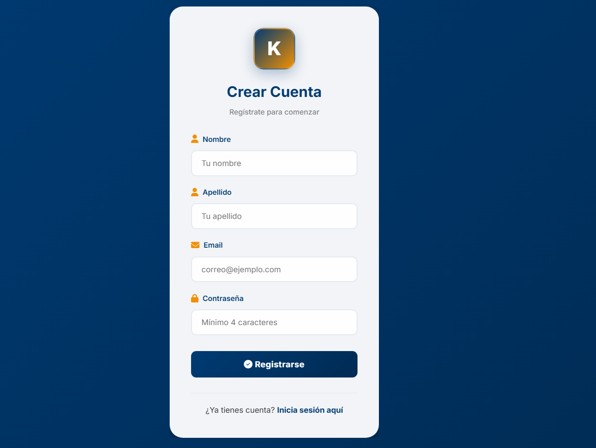
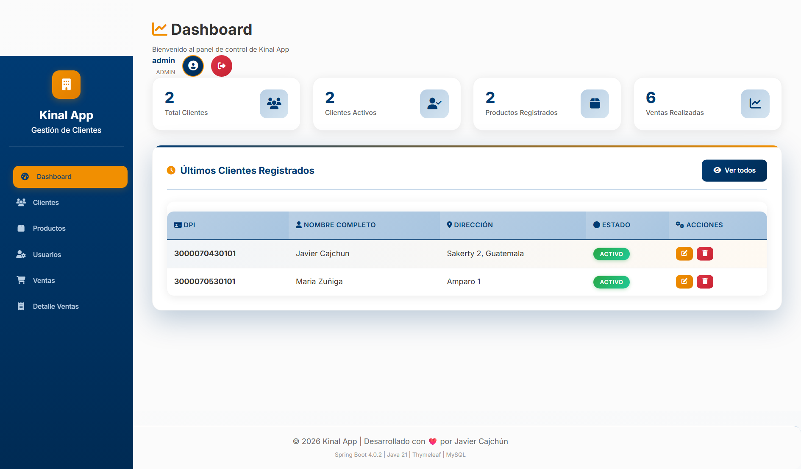
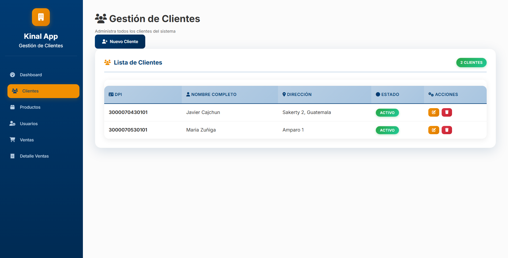
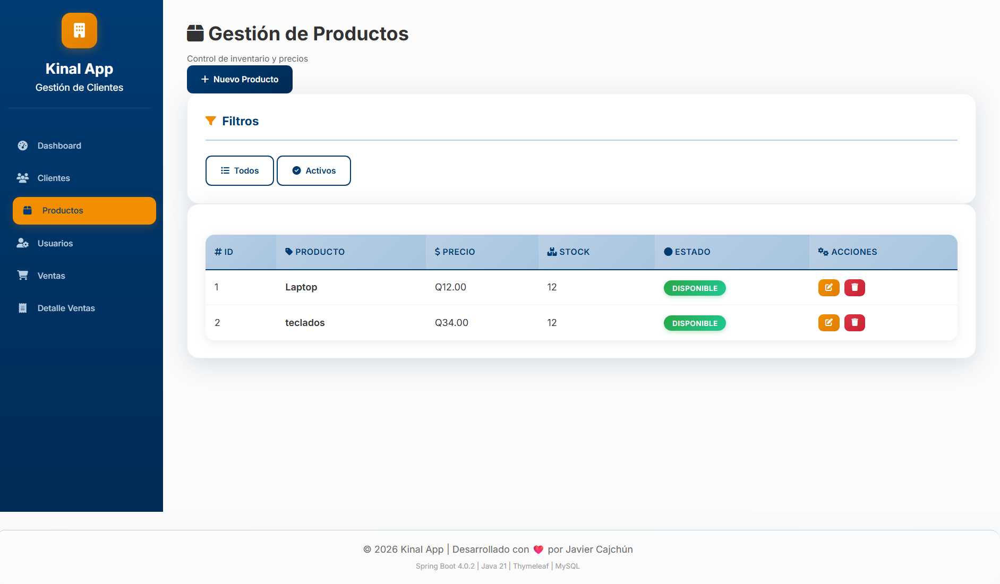
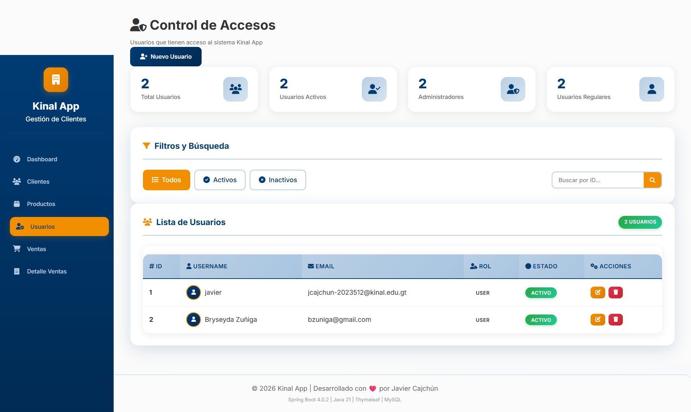
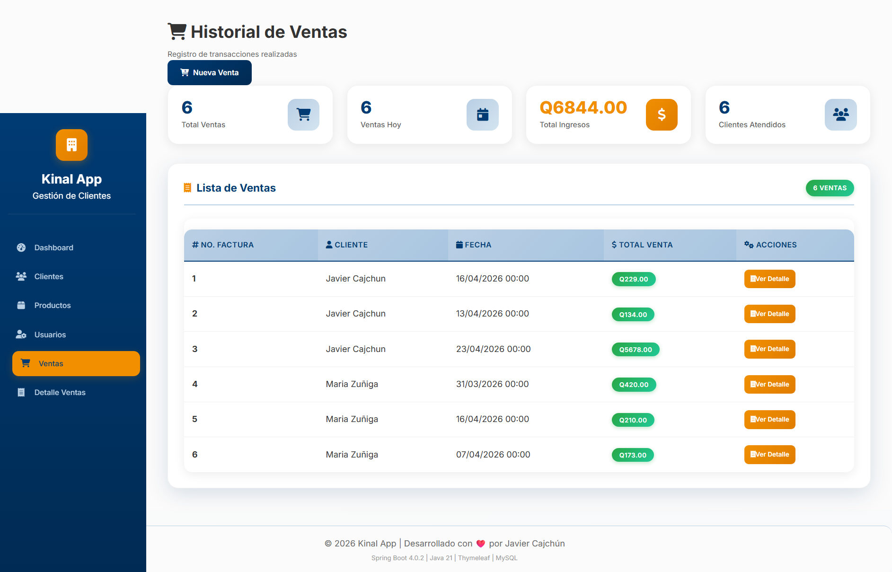
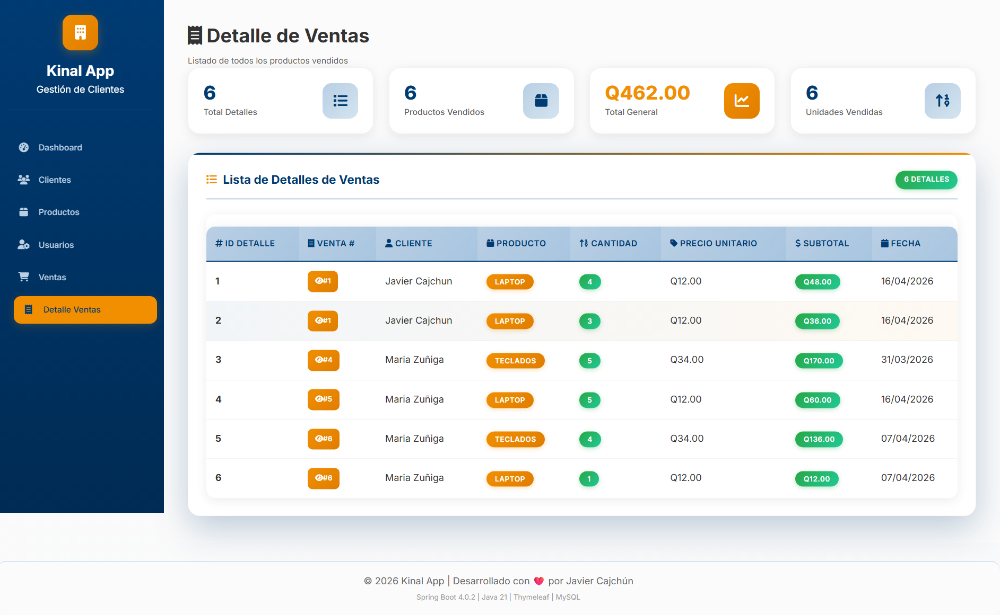

# KinalApp

Descripción del Proyecto

KinalApp es una aplicación web desarrollada con tecnologías modernas del ecosistema Java utilizando Spring Boot. 
Su propósito principal es gestionar el ciclo completo de ventas de un negocio, permitiendo realizar operaciones CRUD (Crear, Leer, Actualizar y Eliminar) sobre entidades clave como:

* Clientes
* Productos
* Usuarios
* Ventas
* Detalle de ventas

La aplicación implementa una arquitectura basada en el patrón MVC (Modelo - Vista - Controlador) e integra tanto backend como frontend mediante Thymeleaf.

## Análisis de los Componentes
* Stack Tecnológico: Utiliza las versiones más recientes y estables del mercado. Java 21 ofrece las últimas mejoras de rendimiento, mientras que Spring Boot 4 (que en el contexto actual de 2026 es el estándar) facilita la configuración automática y el despliegue rápido.
* Arquitectura de Datos: Se apoya en MySQL para el almacenamiento persistente y Maven para manejar todas las librerías necesarias.
* Estructura de Endpoints: La aplicación sigue una lógica de recursos muy clara:
* Gestión de Inventario: Control de productos y monitoreo de stock.
* Gestión de Ventas: Registro detallado de transacciones (Venta y DetalleVenta), lo cual indica que puede manejar múltiples productos por cada factura.
* Seguridad/Control: Gestión de usuarios y estados de actividad (filtros para ver solo registros "activos").

## Arquitectura de Datos

El sistema utiliza MySQL como base de datos relacional y está estructurado en capas:

* Entity → Representación de tablas
* Repository → Acceso a datos (JPA)
* Service → Lógica de negocio
* Controller → Manejo de peticiones HTTP

## Flujo de Trabajo (Instalación)
El proceso descrito es el estándar para un desarrollador:

* Preparación del entorno: Asegurar que el motor de base de datos y el kit de desarrollo (JDK) estén listos.
* Sincronización: Clonar el código desde el repositorio de GitHub.
* Configuración: Es vital el paso de revisar el archivo application.properties, ya que ahí se define la conexión a la base de datos y el puerto de red (en este caso, el 8081).
* Pruebas: Se sugiere el uso de Postman o el navegador para interactuar con los datos a través de las URLs (por ejemplo, para ver la lista de clientes).
* Dato curioso: Aunque usas la etiqueta {dpi} (que es el identificador único en Guatemala), en el desarrollo de software se suele llamar genéricamente {id}. Es genial que esté personalizado para el contexto local.
* Diferenciación de Métodos: Para que esos 3 endpoints funcionen en la misma URL (/{dpi}), Spring Boot utiliza diferentes métodos HTTP: GET para buscar, DELETE para eliminar y PUT/PATCH para actualizar.

## Tecnologias utilizadas
* **Java 21**
* **Spring Boot 4.0.2**
* **Maven** (Gestor de dependencias)
* **MySQL** (Sistema gestor de Base de Datos)

## Requisitos Previos
Antes de ejecutar la aplicación debe tener instalado:
* JDK 17 o superior
* Maven instalado
* Una instancia activa en MySQL

## Instalaciones opcionales
* Postman

## Instalación y Ejecución 
1. Clonar repositorio https://github.com/jcajchun-2023512/KinalApp.git.
2. Abrir Intellij IDEA.
3. Abrir la carpeta que clono.
4. Abrir MySQL en su ordenador.
5. Regresar a Intellij IDEA.
6. Dirigirse a la carpeta "src\main\java\com\javiercajchun".
11. Dirirgirse a KinalAppApplication y ejecutar la aplicación.
12. Abrir la carpeta "resources/application.properties".
13. Verificar que puerto está utilizando la aplicación.
12. Abrir el navegador y poner el puerto http://localhost:8081/.

## Endpoints
### Cliente
1. /clientes → Listar / Crear
2. /estado → Listar activos
3. /{dpi} → Buscar, actualizar o eliminar

### Usuario
1. /usuarios → Listar / Crear
2. /estado → Listar activos
3. /{dpi} → Buscar, actualizar o eliminar

### Producto
1. /productos → Listar / Crear
2. /estado → Listar activos
3. /{dpi} → Buscar, actualizar o eliminar
4. /stock → Consultar stock

### Venta
1. /ventas → Listar / Crear
2. /estado → Listar activos
3. /{dpi} → Buscar y actualizar

### DetalleVenta
1. /detalleVentas → Listar / Crear
2. /estado → Listar activos
3. /{dpi} → Buscar, actualizar o eliminar

## Imagenes

